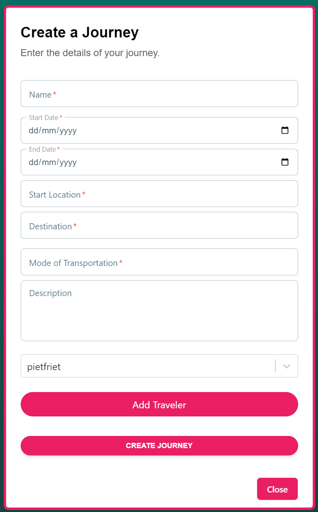
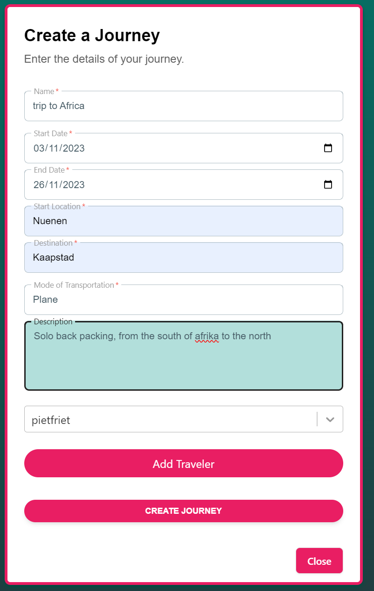
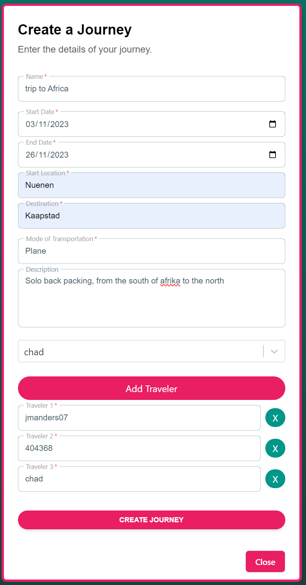
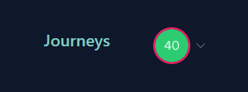
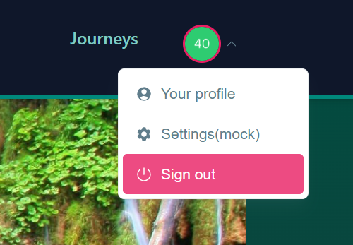
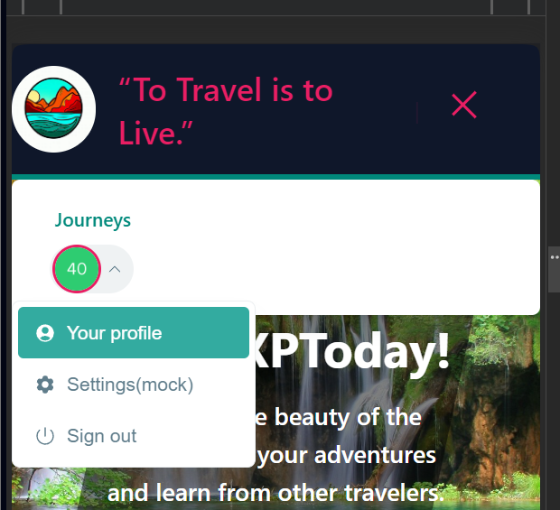

(Animation, 2023)[^2]
# Web Application
> You design and build **user-friendly**, full-stack web applications.
>
> **User friendly:** 	You apply basic User experience testing and development techniques.
> 
>**Full-stack:**
 You design and build a full stack application using commonly accepted front end (Javascript-based framework) and back end techniques (e.g. Object Relational Mapping) choosing and implementing relevant communication protocols and addressing asynchronous communication issues.
>
>[^1]

Table of Contents

- [Web Application](#web-application)
- [Why we implement a web application](#why-we-implement-a-web-application)
- [How do we implement a web application](#how-do-we-implement-a-web-application)
- [pages](#pages)
    - [Welcome Page](#welcome-page)
      - [Features:](#features)
      - [Purpose:](#purpose)
  - 
    - [Journey](#journey)
      - [Features:](#features-1)
      - [Purpose:](#purpose-1)
      - [Form to create new journey](#form-to-create-new-journey)
    - [Daily Moments](#daily-moments)
      - [Features:](#features-2)
      - [Purpose:](#purpose-2)
    - [Login system](#login-system)
    - 
- [Login in the navbar](#login-in-the-navbar)
- [Sources](#sources)

# Why we implement a web application

For our project we have to implement a web application because we have to make a website for our School application. It is also very prominent in the ICT environment and it is a good skill to have.

# How do we implement a web application

We implement a web application by using the following technologies:
- [React](https://reactjs.org/)

This is our project if you want more information:
- [Front-end](https://github.com/TravelXPToday/Frontend)

# pages

We implement the following pages:

### [Welcome Page](https://frontend-puce-one-25.vercel.app)
The Welcome Page  the landing page of a website or application, setting the initial tone for the user experience. It is for when the user is logged in.

#### Features:
- **Introduction:** Offers a snapshot of the application’s purpose and their most current journeys.
- **Navigation:** Guides users to explore other sections.
- **Call to Action:** Invites users to engage with the application. 
  

#### Purpose:
- **Engage:** Captures attention and encourages exploration.
- **Inform:** Offers initial insights into the application’s offerings. Might include new features or updates.

---

### [Journey](https://frontend-puce-one-25.vercel.app/journey)
The Journey page showcases the various journeys they have been on or are currently on. It is for when the user is logged in.

#### Features:
- **List of Journeys:** Displays the user’s journeys.
- **Details:** Provides information about the journey, such as the name, description, and progress.

#### Purpose:
- **Choice:** Allows users to select a journey to explore. and create a new journey.

To create a new journey you have to click on the plus button in the bottom right corner. or on the create journey button.

#### Form to create new journey

The form fields are organized in a responsive layout, with sections for inputting journey details like name, start and end dates, locations, and mode of transportation. Each input field is enhanced with focused background color changes for better user interaction.

Additionally, the form integrates a ReactSelect component to select travelers from a provided list, with an option to add a selected traveler to the journey. The travelers are displayed dynamically with options to edit or remove them. The form concludes with a stylized submit button, designed to catch the user's attention with hover effects and transition animations. The button facilitates the submission of the journey details, wrapping up the user's journey creation experience.

Empty form:

Filled form:

Filled form with selected traveler:

---

###  [Daily Moments](https://frontend-puce-one-25.vercel.app/journey)
Accessible after selecting a journey, Daily Moments allows users to capture and reflect on their daily moments that they want to remember. It is for when the user is logged in.

https://github.com/TravelXPToday/Portfolio/assets/113422379/f03c8691-c8fe-47ff-b0e7-cb2790b5a0f1

#### Features:
- **Recording:** Enables notation of daily experiences or achievements. pictures included
- **Review:** Allows revisiting and reflecting on past entries. allows changes to be made.

#### Purpose:
- **Personalization:** Enhances user engagement through personalized experiences.
- **Reflection:** Encourages users to reflect on their experiences and achievements.
- **Tracking:** Allows users to track their progress and memories.

### Login system

For our login system we use Auth0. Auth0 is an authentication and authorization platform used by developers to add secure user authentication and access control to their applications. It helps manage user identities, enabling single sign-on, social logins, and other authentication methods without developers having to build these systems from scratch. It's a popular tool for simplifying user authentication and ensuring the security of web and mobile applications.

As you can see is is not possible to go to the journey page when you're nog logged in.

When you click on the login button you will see the following login screen. It is possible to create a new account or login into your existing account. You can choose to login with your google account or create an own TravelXPToday account.

When you're logged in you will see it is possible to go to the journeys page. It is also possible to see your account information and see that the login is succesfull.

This is your profile page where you can see all your information. For now you have to contact the developers to change your account information or to delete your account. In the future it will be available for the users to change or delete their account.

###
---

# Login in the navbar
We created a responsive navigation bar component using React, tailored for both desktop and mobile views. For authenticated users, it features a 'Journeys' link and an 'AvatarMenu', while non-authenticated users see a 'LoginButton'. The desktop version displays these options in a horizontally aligned list, whereas the mobile version includes a hamburger button that reveals a similar set of options in a dropdown menu. The component is designed with interactive animations and styling, ensuring a seamless user experience across different devices.

The image below shows the navigation bar in its desktop view. The 'Journeys' link and 'AvatarMenu' are visible, as the user is authenticated. if not their is no menu only a login button.

Login button:

Menu closed:

Menu open:

Mobile view(with hamburger button open):

# Sources

[^1]:Canvas. (n.d.). Canvas outcomes. Retrieved September 21, 2023, from https://fhict.instructure.com/courses/13181/outcomes

[^2]:Angga Dwi Prasetya. (n.d.). animation. Retrieved September 21, 2023, from https://dribbble.com/shots/5574718-Web-development-animation
