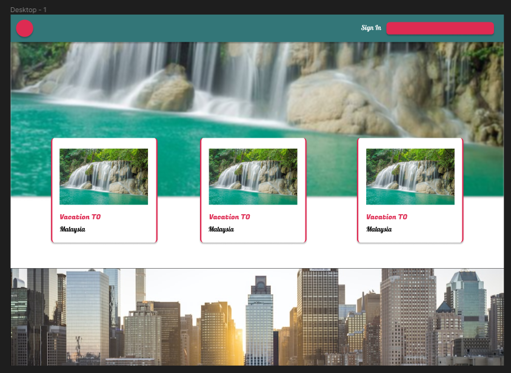
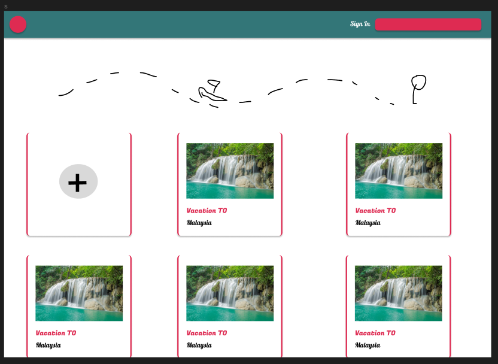
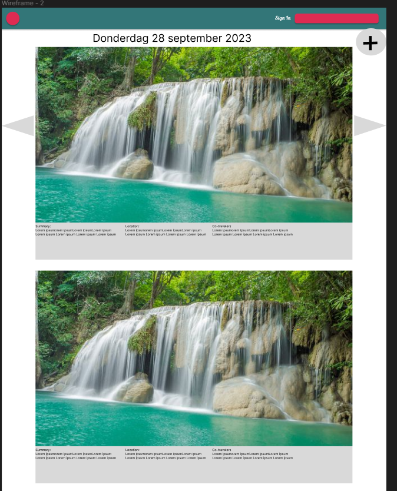
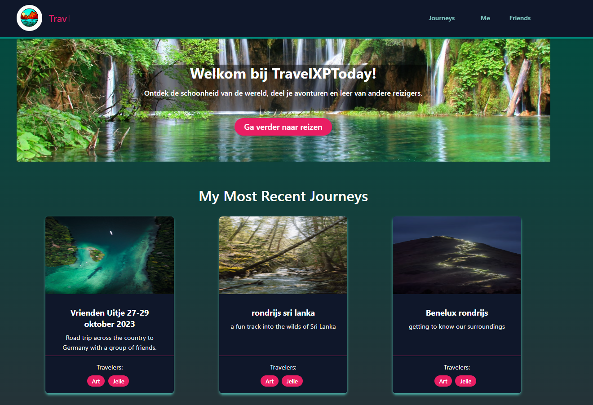
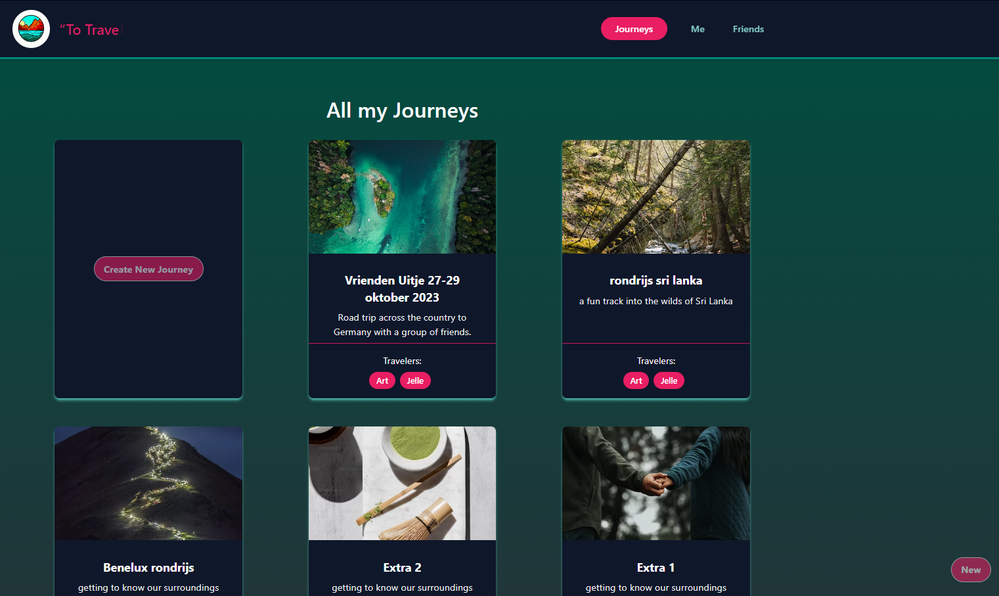

# Requirements and design

 > You translate (non-functional) requirements to extend existing (architectural) designs and can validate them using **multiple types of test techniques**.
 > 
 >**Multiple types of test techniques** : You apply user acceptance testing and stakeholder feedback to validate the quality of the requirements. You evaluate the quality of the design (e.g., by testing or prototyping) taking into account the formulated quality properties like security and performance.
>
>(Canvas outcomes (n.d.))[^1]

 ## Table of contents

- [Requirements and design](#requirements-and-design)
  - [Table of contents](#table-of-contents)
  - [What are designs?](#what-are-designs)
  - [Why do we make designs?](#why-do-we-make-designs)
  - [Our designs](#our-designs)
    - [Functional Design](#functional-design)
    - [User research](#user-research)
    - [Wireframing or prototpye](#wireframing-or-prototpye)
    - [User testing](#user-testing)
  - [What are requirements?](#what-are-requirements)
  - [Why do we make requirements?](#why-do-we-make-requirements)
  - [Our requirements](#our-requirements)
  - [Sources](#sources)

## What are designs?
Designs for a web application are the visual and functional elements that together form the user experience of the application. The design process of a web application includes several steps, including:
- Functional design: This involves determining which screens the web application consists of and how they are linked together.
- User research: This involves understanding the needs and preferences of the users of the application.
- Wireframing or prototyping: This is the creation of a schematic representation of the application to test its functionality and design.
- User testing: This involves testing the application by real users to gather feedback and solve any problems.

(Web App Design: What It Is, Process, and Why You Need It, n.d.)[^2]
## Why do we make designs?
Designing a web application is important to provide a seamless user experience and address the needs of users. The design should take into account the functionality of the application, the target audience, and the company's branding.((UX Designer: Betekenis, Vaardigheden En Taken - Blog Ironhack, n.d.))[^3] It is also important to ensure a responsive site that performs well on various devices and provides a streamlined user journey. (Web App Design: What It Is, Process, and Why You Need It, n.d.)[^2]
## Our designs

### Functional Design
Below you can see our design for our home screen. The three cards are the three last journeys a person has made.

Below you can see our design for the page where you can see al your journeys.

Below you can see our design for our daily moments. In a day you can have multiple daily moments. To see all your daily moments you can scroll trough the page. To see all your days you can click on the arrows on the side of the image.

### User research

//TODO ONDERZOEK UI/UX

### Wireframing or prototpye

Below you can see our prototype of our home page.

Below you can see our prototype of our page where you can see all your journeys you have made.

Below you can see a short movie of our daily moments page.

### User testing

//TODO ANDEREN LATEN TESTEN EN MENINGEN VRAGEN
## What are requirements?
Software requirements are conditions that software must meet. They essentially serve as the contract between the client and the programmers. Before building or updating a software system or website, the requirements are defined to specify exactly what the new software must adhere to. (Van Teeseling, 2020)[^4]
## Why do we make requirements?
Therefore, requirements are necessary both before and during the software development/update process. The importance of a well-written requirement is significant because programmers use it as a guide to ensure that the software meets the requested criteria. If a requirement is poorly formulated (for example, unclear or ambiguous), the resulting software is likely to not meet the client's intended goals. (Van Teeseling, 2020)[^4]
## Our requirements
Our starting user story can we see as requirement. This is our starting user story for our project:
- As a traveller I want to post my vacation trips and share them with friends.
 ## Sources
 [^1]:Canvas. (n.d.). Canvas outcomes. Retrieved September 21, 2023, from https://fhict.instructure.com/courses/13181/outcomes

 [^2]: Web App Design: What It Is, Process, and Why You Need It. (n.d.). Retrieved October 6, 2023, from https://www.hotjar.com/web-app-design/

 [^3]: UX Designer: betekenis, vaardigheden en taken - Blog Ironhack. (n.d.). Retrieved October 6, 2023, from https://www.ironhack.com/nl/blog/wat-is-een-ux-ui-designer

 [^4]: Van Teeseling, B. (2020). Hoe schrijf je een goede software requirement? Centillion. https://www.centillion.nl/development/hoe-schrijf-goeie-software-requirement/