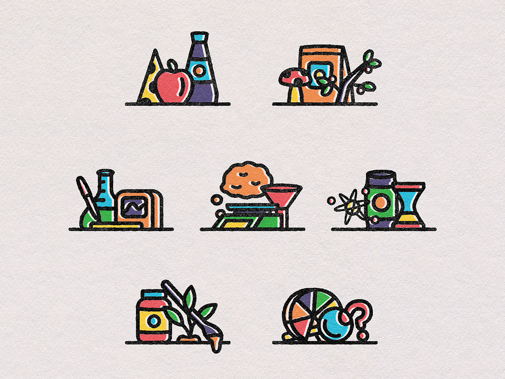

# Requirements and design

 > You translate (non-functional) requirements to extend existing (architectural) designs and can validate them using **multiple types of test techniques**.
 > 
 >**Multiple types of test techniques** : You apply user acceptance testing and stakeholder feedback to validate the quality of the requirements. You evaluate the quality of the design (e.g., by testing or prototyping) taking into account the formulated quality properties like security and performance.
>
>[^1]

 ## Table of contents

- [Requirements and design](#requirements-and-design)
  - [Table of contents](#table-of-contents)
  - [What are designs?](#what-are-designs)
  - [Why do we make designs?](#why-do-we-make-designs)
  - [Our designs](#our-designs)
  - [What are requirements?](#what-are-requirements)
  - [Why do we make requirements?](#why-do-we-make-requirements)
  - [Our requirements](#our-requirements)
  - [Sources](#sources)

## What are designs?

## Why do we make designs?

## Our designs

## What are requirements?

## Why do we make requirements?

## Our requirements

 ## Sources
 [^1]:Canvas. (n.d.). Canvas outcomes. Retrieved September 21, 2023, from https://fhict.instructure.com/courses/13181/outcomes