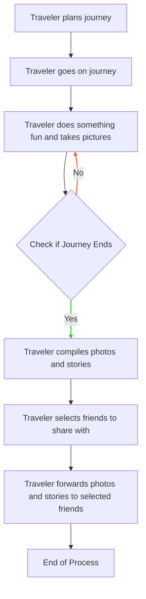
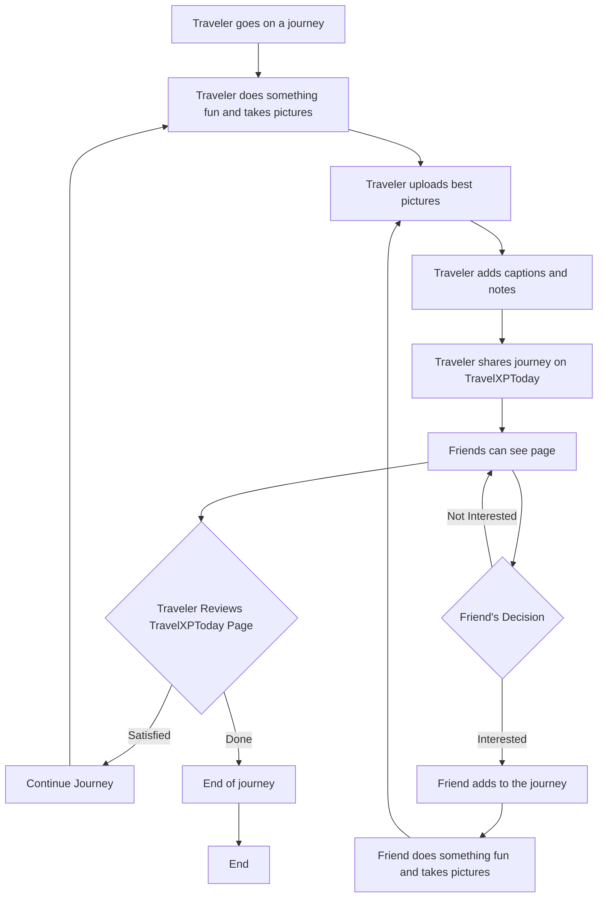

(Ammy S.(n.d.))[^2]

# Business processes

 > You can explain **simple** business processes and **relate** them to the development of your software project.
 > 
 >**Simple** : 	Predominantly sequential processes with one or two alternative paths.
 >
>**Relate** : 	
understanding the relationships between the process and software.
>
>[^1]
>
> ## Business processes
>
> To understand the purpose of our application we made 2 business processes. One old and one new, in this way you can see the difference of the process a traveler goes through.
>
## Old process

## New process

 ## Sources
 [^1]:Canvas. (n.d.). Canvas outcomes. Retrieved September 21, 2023, from https://fhict.instructure.com/courses/13181/outcomes

 [^2]: Ammy S. (n.d.). Work Process Animated Illustration. Dribble. Retrieved September 21, 2023, from https://dribbble.com/shots/8995365-Work-Process-Animated-Illustration
