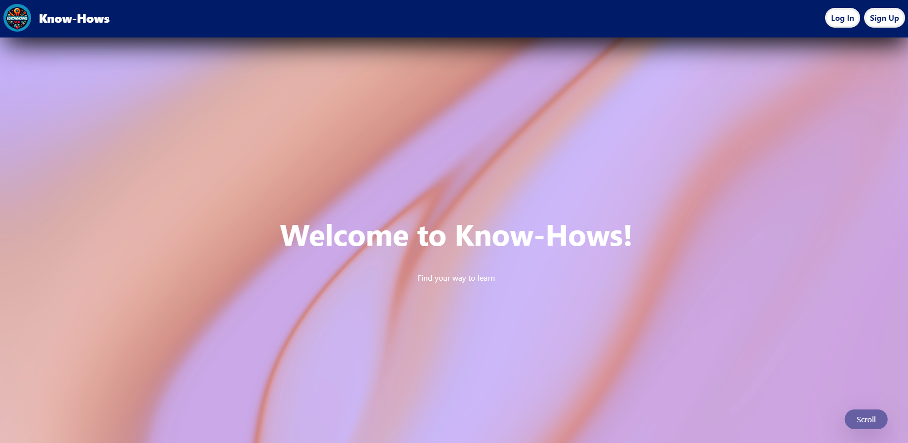

(Animation, 2023)[^1]

Table of Contents

- [Userstories Know-Hows](#userstories-know-hows)
  - [These are the themes and wireframes we tried to recreate for Know-Hows](#these-are-the-themes-and-wireframes-we-tried-to-recreate-for-know-hows)
- [Userstories TravelXPToday](#userstories-travelxptoday)
- [Outscourcing Know-Hows](#outscourcing-know-hows)
- [Retrospective of our outsourcing process](#retrospective-of-our-outsourcing-process)
  - [Team TravelXPToday](#team-travelxptoday)
  - [Team Know-Hows](#team-know-hows)
  - [Outsourcing Positives and struggles](#outsourcing-positives-and-struggles)
  - [Lean Meegdes and Jimmy Schuurmans for TravelXPToday](#lean-meegdes-and-jimmy-schuurmans-for-travelxptoday)
- [Sources](#sources)
  
# Userstories Know-Hows

This is what we implemented for Know-Hows:

This is the Welcomepage we implemented based on the wireframes for Jimmys UI-Spike:
it.

Here is the overview of the articles we implemented for Know-Hows:

When Team Know-Hows implements the articles they will show up here.

## These are the themes and wireframes we tried to recreate for Know-Hows

Based on Skillshare:

# Userstories TravelXPToday

There are the userstories we outsourced to Jimmy and Lean:

# Outscourcing Know-Hows

To show that our working process in valid and understandable. We have outsourced a user story to our friends Jimmy Schuurmans and Lean Meegdes. We also implemented a user story from them. This is to show that we can work with other people and that we can work with other people's code.

# Retrospective of our outsourcing process

**What is SWOT Retrospective?**
The SWOT sprint retrospective assesses the team’s strengths and weaknesses, along with the project’s opportunities and threats. The retrospective is divided into four quadrants:

Strengths are attitudes and behaviors that worked in the past
Weaknesses consist of any attitudes or behaviors that did not work in past projects
Opportunities allow the team to improve
Threats are risks to consider when taking on the project.

## Team TravelXPToday

**Strengths**:
We have been in constant communication, which was productive and not negatively influential.
Divided work nicely what made our schedules line up.

**Weaknesses**:
Should have tried to work better with Jira, instead of drawing our own plan.

**Opportunities**:
write more documentation about what we did. This makes it easier for our companions to understand what we did.

**Threats**:
Don’t do things the companions didn’t asked for. Follow the subtask.

## Team Know-Hows

**Strengths**:
Each of us worked on a different user story to separate the workload.

**Weaknesses**:
We only know how to work with a select amount of industry tools.
We don't always spend enough time on documentation.

**Opportunities**:
We could spend set amounts of time on documentation to ensure consistent progress.

**Threats**:
Control the user story and subtask to find missing items, this to disallow the dependency on missing endpoints or components and to halt work progress.

## Outsourcing Positives and struggles

Jelle Manders and Art Nooijen for Know-Hows

- Because of the research that was done for the UI-Spike there was a clear vision for the design. There was only one wireframe which made it guess what should be on the other pages. With the implied design we were still able to implement the other pages.

- Because the front page was minimalistic, it was easy to apply the styles ourselves.

- The front-end code was a little bit messy so it was hard to understand.

- There were missing back-end functions so we weren't able to create the frontend.

- Vision of the project was clear, thanks to the up to date portfolio.

- Jira was clear with clear user stories. I(Art) learned I don't like Jira. Same for me (Jelle). So this was not a problem of the team but the tools used.

## Lean Meegdes and Jimmy Schuurmans for TravelXPToday

Pros:

- It was nice to have the mermaid image when you direct to the default API route, this was good to see if the API was working.
- The code was very easy to understand excluding differences in coding languages.
The user stories in the github project Kanban board were very clear so we could easily find out what was expected from the user story and requirements.

Cons:

- The startup documentation was a bit confusing especially for the back-end.
- When the project is being outsourced, mention what the most up-to-date branch is to branch from.

# Sources

[^1]: Animation. (n.d.). Dribbble. Retrieved September 21, 2023, from https://dribbble.com/shots/7155620/attachments/159925?mode=media

