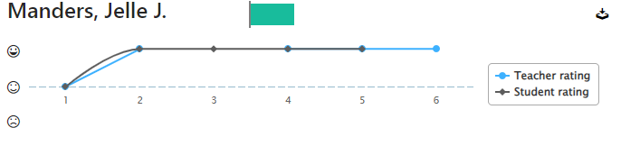

(Travel Selfie, n.d.) [^1]

# Portfolio
*By Art Nooijen and Jelle Manders*
# TravelXPToday

### Description
 > Discover the joy of shared adventures with  Our platform brings friends together, allowing everyone to contribute to a single journey. As you explore, each member can add their own experiences, photos, and memories, creating a collective travel diary. Dive into our interactive dashboard to relive group adventures and see the tapestry of stories you've woven together. Plus, challenge yourselves with unique badges to earn as a team. 
## About the TravelXPToday
### Front-end
- <a href="http://reactjs.org/">React</a>
### Back-end
- <a href="https://flask.palletsprojects.com/en/2.3.x/">Flask</a>
#### Here you can find:
- [Back-End](https://github.com/TravelXPToday/Backend/blob/main/README.md)
- [Front-End](https://github.com/TravelXPToday/Frontend/blob/main/README.md)

## proof of learning outcomes
|learning Outcomes| Proof|
|:---|:---|
|Web Application| [🔗](https://github.com/TravelXPToday/Portfolio/blob/main/Learning%20Outcomes/1.%20Web%20application.md)| 
|Software Quality| [🔗](https://github.com/TravelXPToday/Portfolio/blob/main/Learning%20Outcomes/2.%20Software%20quality.md)|
|Agile Method | [🔗](https://github.com/TravelXPToday/Portfolio/blob/main/Learning%20Outcomes/3.%20Agile%20method.md)|
|CI-CD|[🔗](https://github.com/TravelXPToday/Portfolio/blob/main/Learning%20Outcomes/4.CI-CD.md)
|Cultural Differences and ethics|[🔗](https://github.com/TravelXPToday/Portfolio/blob/main/Learning%20Outcomes/5.%20Cultural%20Differences%20and%20ethics.md)
|Requirements and design|[🔗](https://github.com/TravelXPToday/Portfolio/blob/main/Learning%20Outcomes/6.%20Requirements%20and%20design.md)
|Business processes|[🔗](https://github.com/TravelXPToday/Portfolio/blob/main/Learning%20Outcomes/7.%20Business%20processes.md)
|Professional|[🔗](https://github.com/TravelXPToday/Portfolio/blob/main/Learning%20Outcomes/8.%20Professional.md)

|Learning Outcomes|Rating|Clarification of Outcomes|
|---|--|---|
|You design and build user-friendly, full-stack web applications.| Advanced | - **User-friendly**: We've done research to create the best UX. We did a color scheme analysis and created wireframes. After this we created a user friendly frontend for TravelXPToday. We also made a user friendly frontend for [Know-Hows](https://github.com/Know-Hows), Our outsourcing partner. [Documentation outsourcing](./Management/Outsourcing%20Know-Hows.md).   - **Full stack**: We designed and created a full stack distributed application with react as frontend(fetch api) and python (http rest api) as backend. For our database we used MongoDB. We used vercel and docker to deploy our application. For our authentication system we used auth0. We limited the functions for not logged in users.|
|You use software tooling and methodology that continuously monitors and improve the software quality during software development.| Proficient | We maintain high code quality by implementing the following methods   - **Tooling and methodology**: We implement [SonarCloud](https://sonarcloud.io/explore/projects) for code smells, vulnerabilities, duplicated code lines and bugs. We implemented [Unlighthouse](https://unlighthouse.dev) for our performance. We also implemented Github actions to run Unit tests every night at 00:00. In the backend we implemented [pytest](https://docs.pytest.org/en/7.4.x/) to test the backend. We get a coverage of what's tested. We implemented [mypy](https://mypy-lang.org) for type testing. For acceptance tests we use [vercel](https://vercel.com). We created a special test environment to test.   -**Todo for advanced**: Change our tests so they work with our authentication system. Implement API endpoint tests using newman(Postman)
|You choose and implement the most suitable agile software development method for your software project.| Advanced | - **Choose**: We did a research in our group project how to use agile. We worked in 2 week sprints. Every day we did a standup, after every sprint we did a retrospective and a refinement. We worked in a structured way with our Github project board. We sorted our issues based on learningoutcome, MoSCoW and userstory. We also used a timeline to plan issues. We got compliments from Leon and Thijs for our way of working.
|You design and implement a (semi)automated software release process that matches the needs of the project context.| Proficient| -**Design and implement**: We implemented CI/CD using github actions, Docker and Vercel. See proof of learning outcome 4. CI/CD.   **Todo for advanced**: -Do more research and implement more automatization
You recognize and take into account cultural differences between project stakeholders and ethical aspects in software development.| Advanced | -**Recognize**: We implemented our github project to be international. We've done a research about cultural UX.   **Take into account**- This is further implemented in our [group project](https://github.com/Colleak/Documentation).
|You analyze (non-functional) requirements, elaborate (architectural) designs and validate them using multiple types of test techniques.| Proficient | We implemented acceptance testing when we review eachothers code. We test using vercel test environment. Architectural we have a 3 layer backend with interfaces. See learning outcome webapplication for a detailed view. We also made a diagram with Mermaid to visualize our endpoints, classes etc. We made user stories for individual project and for group project we made enough user stories for the whole project and showed them to stakeholders.
|You analyze and describe simple business processes that are related to your project.| Proficient | We made 2 business processes in our group project. We also did this for our individual project. [Business process TravelXPToday](). 
|You act in a professional manner during software development and learning.| Advanced | We are using Github Board (Kanban) with our backlog, current sprint and review tab. We also made a definition of done so its clear for both of us when a subject is really done. We also made a coorperation contract with a couple of rules to improve the coorperation between Art and Jelle. Our communication with our teacher is in a very professional way. We have shown with our outsourcing project that our project is readable, unstandable and maintainable for other software developers. We also showed our professionality to jump in a unknown project and implement a userstory. [Outsourcing documentation](). We have actively asked feedback and applied it when we thought it was necessary. 

# Research
We have done research about the following subjects:
- API-Keys see [🔗](https://github.com/TravelXPToday/Portfolio/blob/main/Research/Security%20research.pdf)
- UX-UI see [🔗](https://github.com/TravelXPToday/Portfolio/blob/main/Research/UX_UI%20Research.pdf)
#### Sources:
[^1]: Travel Selfie. (n.d.). Dribbble. https://dribbble.com/shots/2350607-Travel-Selfie
